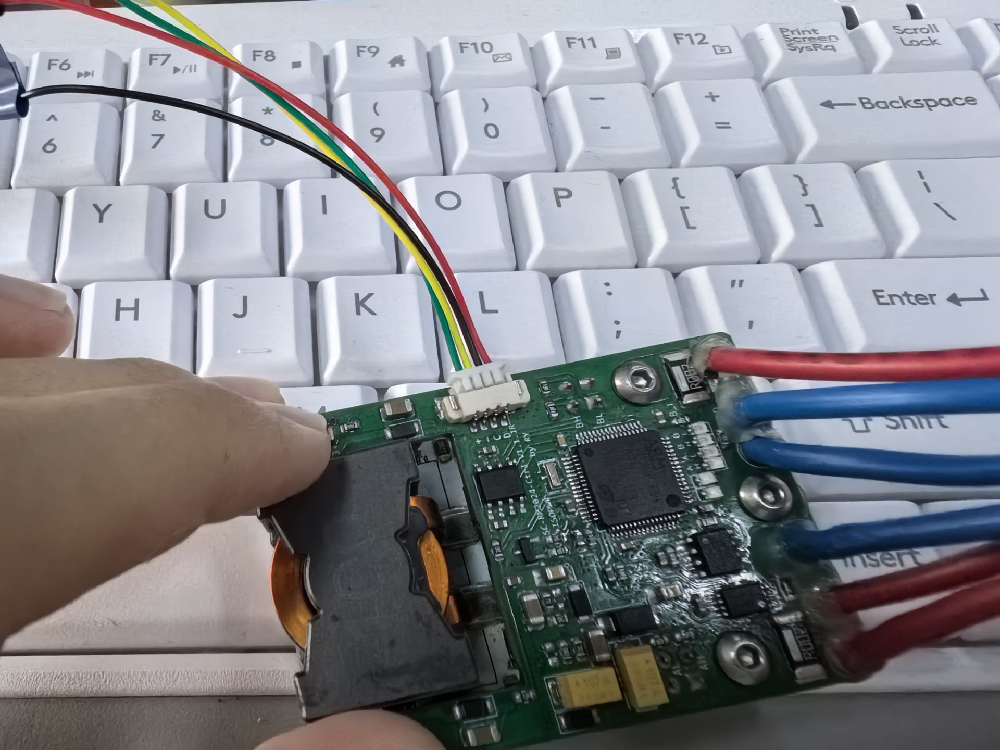
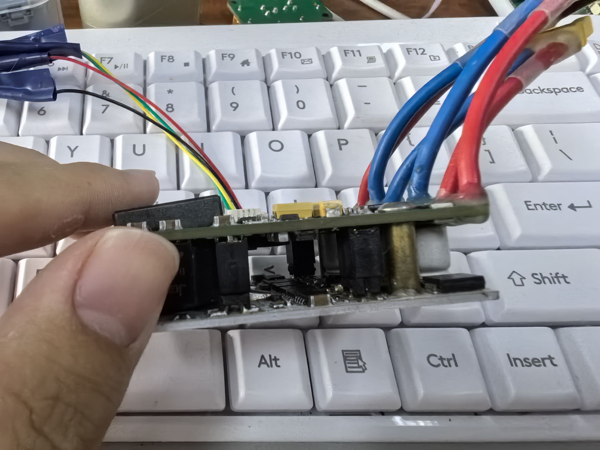
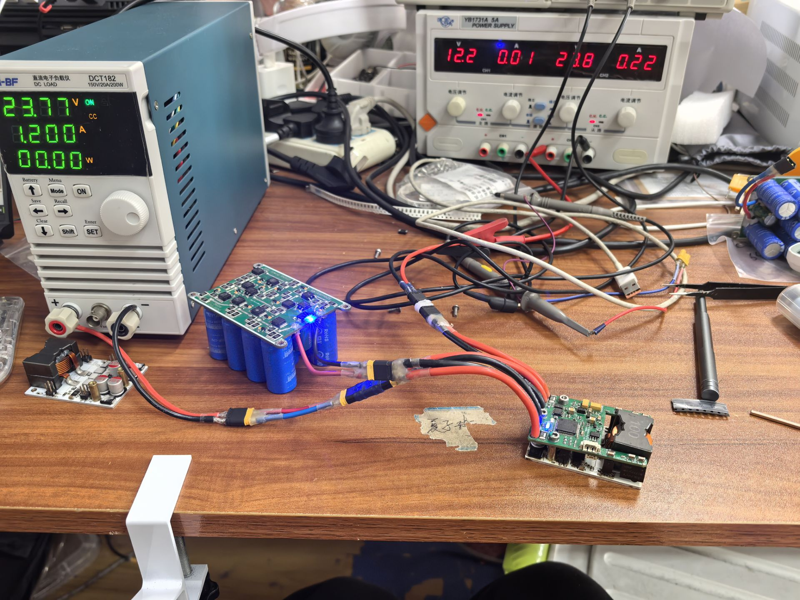
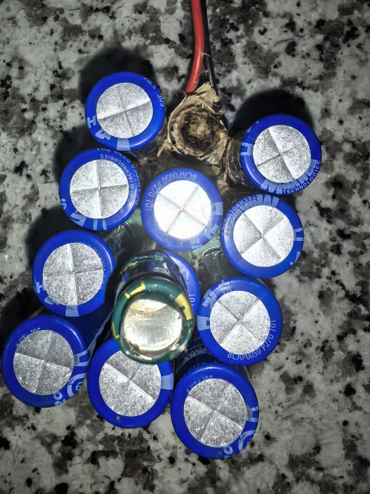

# RM_SUPERCAP_JSU_V2
复刻香港科技大学  

**[项目技术说明笔记](PROJECT_OVERVIEW.md)**

工具链用STM32CubeMX+GCC+jlink_mini+OZONE调试下载  
主要代码用C++编写,然后extern "C"给出接口  

  
**11.1**  
现在的问题是电容端口短路,初步怀疑是原件选型错误,解决方法:加上了群里的同学一起讨论,和队里的研究生一起排查,看研究生的学习笔记,学习C++  
**11.13**  
GAME WILL OVER，lucky,终于冲放电成功了，不报错，不过另一个的上板电流采样芯片可能坏了，等快递   
**11.15**  
研究生学姐走了，剩下的成果归本人所有  
**11.18**  
第二个也做出来了，一开始错误的原因是底盘电流检测芯片选型错误，要INA240PW1才是对的，INA240PW2的增益是不同的  
这就是我们战队5年没做出来的东西？这如此种种也不过如此啊  

**11.19**  
炸了....

**11.20**  
上车正常，最终效果：可以成功存储能量，要用的时候再输出，根据功率自动选择存储还是释放，功率闭环+缓冲能量闭环，限制电池输出功率在50以内，不加超电电池输出在轮子转的时候是79左右，峰值100多，  
注意：不要随意DEBUG，在电容连接上的时候DEBUG会使保护程序失灵，可能会炸  
注意：电池电压低会导致超电无法使用，  
本工程设计电流检测：用INA240PW1芯片，测量电阻是2MR，电压检测用了运放+分压电阻测量，主要的升降压电路采用H桥方案，串级PID有功率换（外），电流环（内）/电压环（内），滤波用了滤波二极管除尖峰，一旦下板短路，二极管一般会先被击穿，保护主要电路，还有一些电容，升降压放在铝基板上散热，上板用了STM32F334R8作为主控芯片，设计CAN通信电路，蜂鸣器和LED用于提示，测量电路也在上板，双层板的设计起到了隔离数字地模拟地的作用，第二是节省空间   
