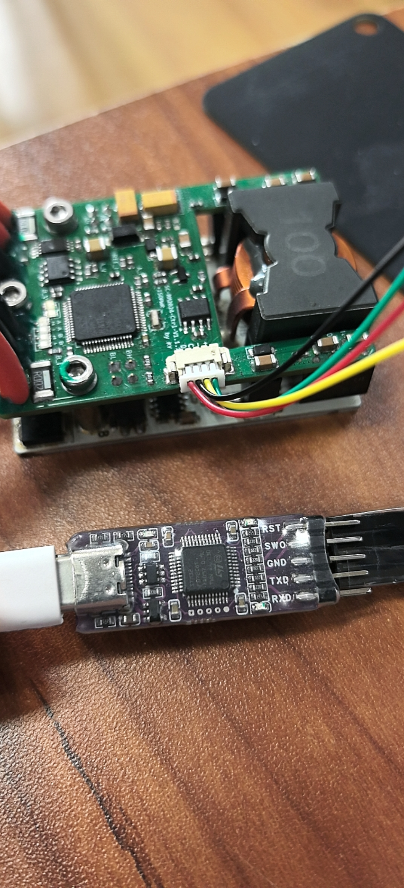
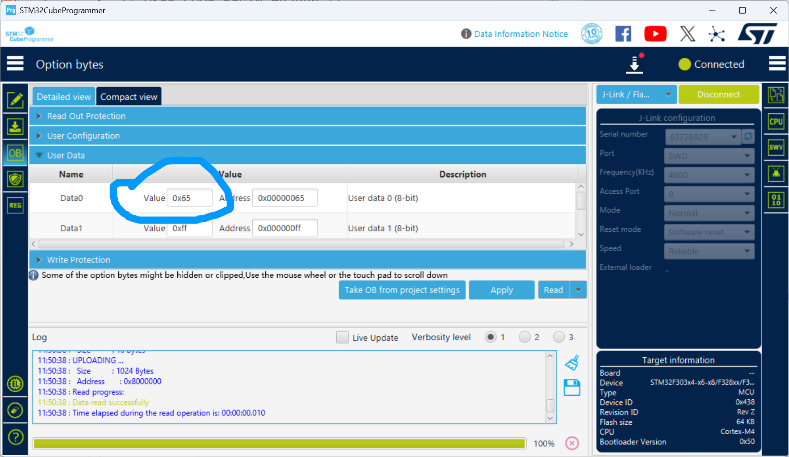
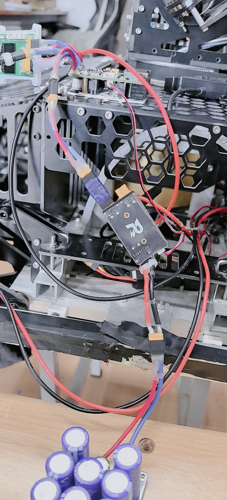

# 超电傻瓜式使用教程

## 📥 第一步：下载代码

使用 **OZONE + JLink** 进行代码下载。


---

## 🔧 第二步：修改硬件ID（新做超电必做）

如果要新做超电，**必须**使用 **STM32CubeProgrammer** 修改硬件ID。

### 操作步骤：
1. 打开 STM32CubeProgrammer
2. 连接设备
3. 将硬件ID修改为 **101**（无论使用什么方法）

> **⚠️ 重要提示：**  
> 如果不修改硬件ID，蜂鸣器会一直响！

> **操作示例：**  
> 请参考示例图片进行操作
  
---

## 🔌 第三步：上电测试

### 3.1 上板供电测试

1. **先给上板供电**
2. **测量电压**：
   - 12V 接口 *(实际约 10V)*
   - 5V 接口
   - 3.3V 接口
3. **确认电压正常后**，再连接下板

### 3.2 预期状态

连接下板后：
- **正常情况**：不报错
- **可能情况**：报错代码 33（在 OZONE 中查看）

---

## ⚡ 第四步：负载测试

### 4.1 连接电子负载

1. 将**电子负载仪**连接到**底盘端口**
2. **限制输出电流**

### 4.2 连接电容

1. 将**电容**连接到**电容模块**
2. **⚠️ 一定要小心操作！**
3. **注意：不要让 DEBUG 停下来**

---

## 🔌 接线说明

### 端口连接示意（从正面看）

```
┌─────────────────────────────────┐
│  左侧        中间        右侧    │
│ 电源(电管)  底盘(中心板)  电容   │
│  电流流入    电流流出    储能端  │
└─────────────────────────────────┘
```

- **右边**：接电容
- **中间**：接底盘（中心板）—— 电流流出
- **左边**：接电源（电管）

> **接线示例：**  
> 请参考示例图片进行操作

---

## 🏁 超电裁判系统接法

> **接线示例：**  
  

---

## 🚨 故障排查

### 短路问题

如果发生短路，**大概率是下板的滤波二极管损坏**：

1. **位置**：角落里的两个大号二极管
2. **测试方法**：测量时两边都会导通一会  
   *(注意：不同二极管可能表现不同)*

### 其他问题

- 只要元件都相同，一般不会有问题
- 如有问题，**拿正常的超电进行对比测试**即可

---

## 📡 第五步：CAN通信配置

> **提示**：车上的CAN通信已经修改过了，你们应该不用再改。
> [supercap.c](super_cap.c)
> [supercap.h](super_cap.h)
---

## ✅ 完成

按照以上步骤操作，超电即可正常使用！

---

*文档最后更新：2025年11月20日*


